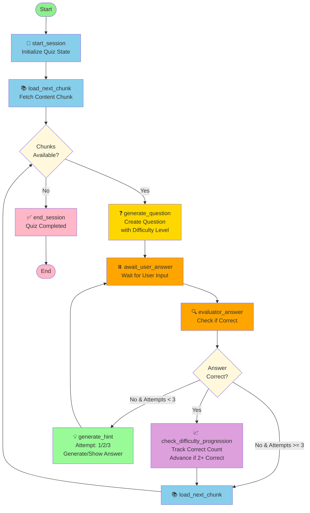

# Quiz Workflow Diagram



## Node Descriptions

| Node | Purpose | Transitions |
|------|---------|-------------|
| **start_session** | Initialize quiz state, set difficulty to "easy" | → load_next_chunk |
| **load_next_chunk** | Fetch next content chunk from ChromaDB or topic_chunks | → check_chunks_available |
| **generate_question** | Create multiple-choice question based on difficulty level | → await_user_answer |
| **await_user_answer** | Pause execution and wait for user answer (interrupt) | → evaluator_answer |
| **evaluator_answer** | Compare user answer with correct answer | → route_based_answer |
| **check_difficulty_progression** | Increment correct count; advance difficulty after 2 consecutive correct | → load_next_chunk |
| **generate_hint** | Generate hints (attempt 1-2) or show correct answer (attempt 3) | → await_user_answer |
| **end_session** | Complete quiz when no more chunks available | → END |

## Difficulty Progression

```
🟢 Easy (Recall) 
    ↓ (2 consecutive correct)
🟡 Medium (Understanding)
    ↓ (2 consecutive correct)
🔴 Hard (Synthesis)
```

## Decision Points

### check_chunks_available
- **Yes** → Generate next question
- **No** → End quiz session

### route_based_answer
- **Correct** → Check difficulty progression
- **Wrong (attempts < 3)** → Generate hint
- **Wrong (attempts ≥ 3)** → Load next chunk
